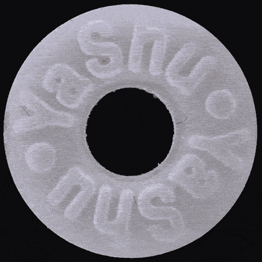

<h1 align="center">HiAD: A General High-Resolution Industrial Image Anomaly Detection Framework</h1>
  
  
<div align="center" style="display: flex; justify-content: center; flex-wrap: wrap;">
  <a href='https://arxiv.org/abs/2508.12931'></a>&ensp; 
  <a href='https://pypi.org/project/hiad/'></a>&ensp; 
  <a href='https://huggingface.co/XimiaoZhang'></a>&ensp;
  <a href='LICENSE'></a>&ensp; 
  <a href='tutorial/quick_start.md'></a>&ensp; 
  <a href='README_zh.md'></a>&ensp;
</div>
  
  
Current anomaly detection methods are primarily designed for low-resolution images. 
However, in modern industrial production, anomalies often appear as subtle and hard-to-detect defects, 
making them difficult to identify effectively under low-resolution conditions. To address the industry 
challenge of **large images with small defects**, we conducted a systematic study focusing on 
high-resolution industrial image anomaly detection. We thoroughly analyzed the key challenges of this 
task, established a comprehensive evaluation benchmark, and proposed HiAD, a practical and 
efficient high-resolution anomaly detection framework. This framework can accurately detect subtle 
anomalies in images ranging from 1K to 4K resolution, while ensuring fast inference speeds on 
mainstream consumer-grade GPUs. If you are a researcher in this field, 
we invite you to read our [paper](https://arxiv.org/abs/2508.12931) for more technical details.
  
<div align="center">  
    
|            *2048 × 2048*        |             *4096 × 4096*        |
| :------------------------------: | :-------------------------------: |
|  |   |  
  
</div>  
  
##  News
 - **[09.2025]: Updated DINOv3-based [Dinomaly](runs/run_dinomaly.py) and [INP-Former](runs/run_inpformer.py).**
 - **[01.2026]: Updated HiAD v0.2 to support [online inference and deployment](tutorial/online_inference.md).**
## 🔧 Installation
  
```
$ pip install hiad[cuda11] # for Linux with cuda11 
$ pip install hiad[cuda12] # for Linux with cuda12
$ pip install hiad[cuda]   # for Linux with other cuda versions
$ pip install hiad         # for Windows
```  
<sub><em>Since `faiss-gpu` is not supported on Windows, some features of HiAD may be limited on Windows systems.</em></sub>

## 📖 Tutorial
  
<table>
  <tr><td align="center"><a href='tutorial/quick_start.md'>Quick Start</a></td><td align="center">Quickly understand how HiAD works through a simple example.</td></tr>
  <tr><td align="center"><a href='tutorial/advanced.md'>Advanced Settings</a></td><td align="center">Learn about HiAD's advanced features.</td></tr>
  <tr><td align="center"><a href='tutorial/customized_detectors.md'>Custom Detector</a></td><td align="center">Integrate more anomaly detection algorithms with HiAD.</td></tr>
  <tr><td align="center"><a href='tutorial/online_inference.md'>Online Inference</a></td><td align="center">Efficient inference and deployment.</td></tr>
</table>

## 🚀 Datasets
  
| Datasets |  Hugging Face | ☁️Google Drive |
|:------:|:--------:|:-------:|
| MVTec-2K | [XimiaoZhang/MVTec-2K](https://huggingface.co/datasets/XimiaoZhang/MVTec-2K)  | [MVTec-2K.zip](https://drive.google.com/file/d/1giNfM75RWnciIH9KJUIygU-6_aWikoBh/view?usp=drive_link)  |
| VisA-2K  | [XimiaoZhang/VisA-2K](https://huggingface.co/datasets/XimiaoZhang/VisA-2K)    | [VisA-2K.zip](https://drive.google.com/file/d/1kg6rhVPT-zwsleSZi_-6Hlu9D6TxS3ut/view?usp=drive_link)  |
| MVTec-4K | [XimiaoZhang/MVTec-4K](https://huggingface.co/datasets/XimiaoZhang/MVTec-4K)  | [MVTec-4K.zip](https://drive.google.com/file/d/10cY3sel_bqlPrqfPCv-yGVQPU2rSe7nQ/view?usp=drive_link)  |

## 🌞 Experiments
  
If you would like to reproduce our experiments, please clone our repository and install:

```
$ git clone https://github.com/cnulab/HiAD.git
$ cd HiAD
$ pip install -e .[cuda11] # for Linux with cuda11 
$ pip install -e .[cuda12] # for Linux with cuda12
$ pip install -e .[cuda]   # for Linux with other cuda versions
$ pip install -e .         # for Windows
```   
Refer to [data/README](data/README.md) for dataset preparation.

The experiment scripts are located in the [runs](runs) directory. Run them using the following command:  
```
# taking PatchCore as an example, for 2 GPUs
python runs/run_patchcore.py --data_root data/MVTec-2K --category bottle --gpus 0,1
```  
  
## 💌 Acknowledgement  
  
If you encounter any issues during usage, feel free to open an `issue` and reach out to us.   
  
If you find it useful, consider giving us a ⭐, we’d really appreciate it!
  
## 📌 Citation  
```
@inproceedings{zhang2025towards,
      title={Towards High-Resolution Industrial Image Anomaly Detection}, 
      author={Ximiao Zhang, Min Xu, and Xiuzhuang Zhou},
      year={2025},
      eprint={2508.12931},
      archivePrefix={arXiv},
      primaryClass={cs.CV}
}
```


