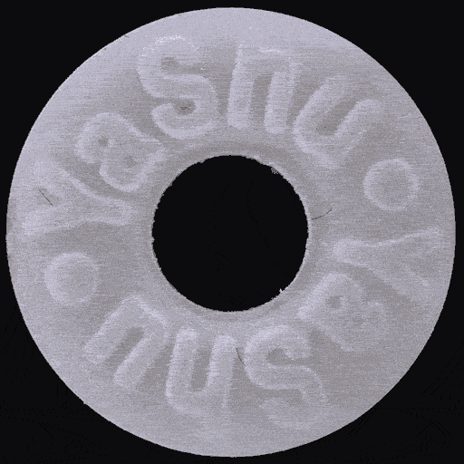
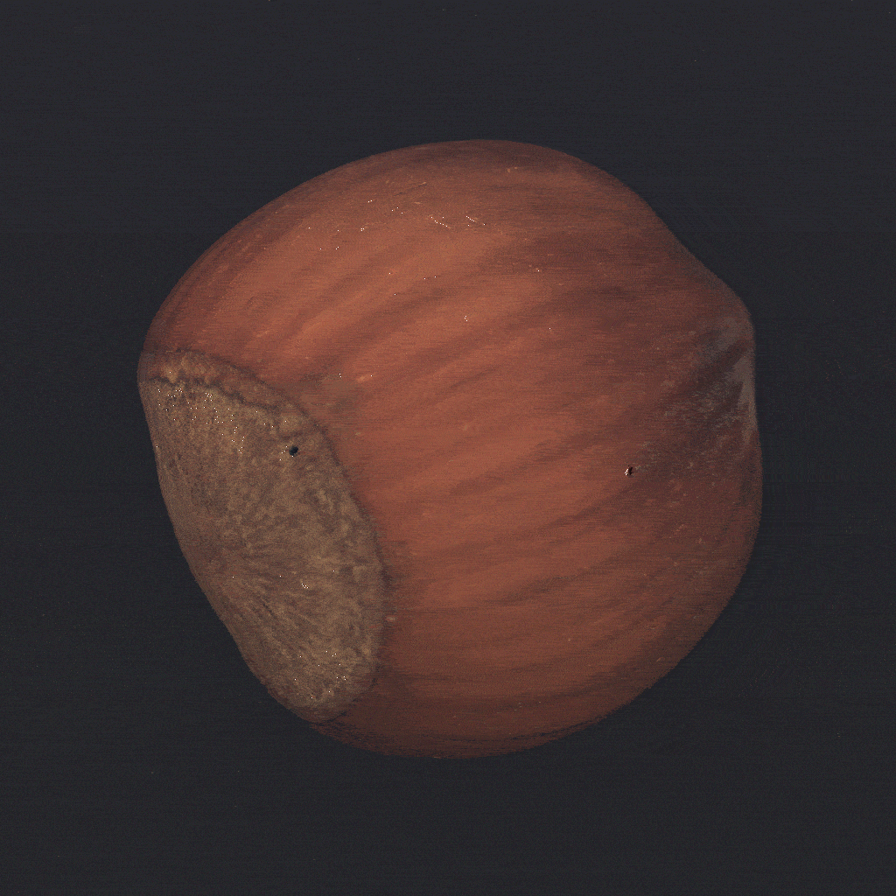

<h1 align="center">HiAD: 通用的高分辨率工业图像异常检测框架</h1>
  
  
<div align="center" style="display: flex; justify-content: center; flex-wrap: wrap;">
  <a href='https://arxiv.org/abs/2508.12931'></a>&ensp; 
  <a href='https://pypi.org/project/hiad/'></a>&ensp; 
  <a href='https://huggingface.co/XimiaoZhang'></a>&ensp;
  <a href='LICENSE'></a>&ensp; 
  <a href='tutorial/quick_start_zh.md'></a>&ensp; 
  <a href='README.md'></a>&ensp;
</div>
  

当前的异常检测方法主要针对低分辨率图像设计，然而在现代工业生产中，异常往往表现为细微且难以察觉的缺陷，在低分辨率条件下难以有效检测。
针对**大图小缺陷**的行业痛点，我们开展了一项系统性研究，专注于高分辨率工业图像的异常检测。我们深入分析了该任务所面临的关键挑战，
构建了全面的评估基准，并提出了一个实用且高效的高分辨率异常检测框架——HiAD。该框架可在1K至4K分辨率图像中精准识别微小异常，同时具备良好的推理速度，
适配当前主流的消费级GPU平台。若您从事相关研究，欢迎查阅我们的[论文](https://arxiv.org/abs/2508.12931)，获取更多技术细节。
  
<div align="center">  
    
|            *2048 × 2048*        |             *4096 × 4096*        |
| :------------------------------: | :-------------------------------: |
|  |   |  
  
</div>  

## 更新日志  
 - **[2025-09] 更新了基于DINOv3的[Dinomaly](runs/run_dinomaly.py)和[INP-Former](runs/run_inpformer.py).**
 - **[2026-01] 更新了HiAD 0.2版本以支持[在线推理和部署](tutorial/online_inference_zh.md).**

## 🔧 安装
  
```
$ pip install hiad[cuda11] # 适用于 Linux 和 cuda11 
$ pip install hiad[cuda12] # 适用于 Linux 和 cuda12
$ pip install hiad[cuda]   # 适用于 Linux 和 其他cuda版本
$ pip install hiad         # 适用于 Windows
```  
<sub><em>由于依赖项`faiss-gpu`暂不支持Windows系统，因此HiAD的部分功能可能在Windows系统下受限。</em></sub>

## 📖 教程
  
<table>
  <tr><td align="center"><a href='tutorial/quick_start_zh.md'>快速开始</a></td><td align="center">通过一个简单的示例快速了解HiAD的工作原理</td></tr>
  <tr><td align="center"><a href='tutorial/advanced_zh.md'>高级设置</a></td><td align="center">了解HiAD的高级功能</td></tr>
  <tr><td align="center"><a href='tutorial/customized_detectors_zh.md'>自定义检测器</a></td><td align="center">将更多异常检测算法与HiAD集成</td></tr>
  <tr><td align="center"><a href='tutorial/online_inference_zh.md'>在线推理</a></td><td align="center">高效推理与部署</td></tr>
</table>

## 🚀 数据集  
  
| 数据集 |  Hugging Face | ☁️Google Drive |
|:------:|:--------:|:-------:|
| MVTec-2K | [XimiaoZhang/MVTec-2K](https://huggingface.co/datasets/XimiaoZhang/MVTec-2K)  | [MVTec-2K.zip](https://drive.google.com/file/d/1giNfM75RWnciIH9KJUIygU-6_aWikoBh/view?usp=drive_link)  |
| VisA-2K  | [XimiaoZhang/VisA-2K](https://huggingface.co/datasets/XimiaoZhang/VisA-2K)    | [VisA-2K.zip](https://drive.google.com/file/d/1kg6rhVPT-zwsleSZi_-6Hlu9D6TxS3ut/view?usp=drive_link)  |
| MVTec-4K | [XimiaoZhang/MVTec-4K](https://huggingface.co/datasets/XimiaoZhang/MVTec-4K)  | [MVTec-4K.zip](https://drive.google.com/file/d/10cY3sel_bqlPrqfPCv-yGVQPU2rSe7nQ/view?usp=drive_link)  |

## 🌞 实验 
  
如果您想复现我们的实验，首先克隆我们的仓库并安装：

```
$ git clone https://github.com/cnulab/HiAD.git
$ cd HiAD
$ pip install -e .[cuda11] # 适用于 Linux 和 cuda11 
$ pip install -e .[cuda12] # 适用于 Linux 和 cuda12
$ pip install -e .[cuda]   # 适用于 Linux 和 其他cuda版本
$ pip install -e .         # 适用于 Windows
```  
按照 [data/README](data/README.md) 准备数据集。  
  
实验脚本位于 [runs](runs) 目录，使用以下命令运行：

```
# 以 PatchCore 为例
python runs/run_patchcore.py --data_root data/MVTec-2K --category bottle --gpus 0,1
```  
  
## 💌 致谢  
  
在使用过程中遇到的任何问题，欢迎创建`issues`与我们交流。  
  
如果你觉得本项目对你有帮助，欢迎点个 ⭐️支持一下！我们将不甚感激！  
  
## 📌 引用  
```
@inproceedings{zhang2025towards,
      title={Towards High-Resolution Industrial Image Anomaly Detection}, 
      author={Ximiao Zhang, Min Xu, and Xiuzhuang Zhou},
      year={2025},
      eprint={2508.12931},
      archivePrefix={arXiv},
      primaryClass={cs.CV}
}
```


